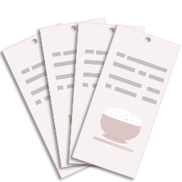
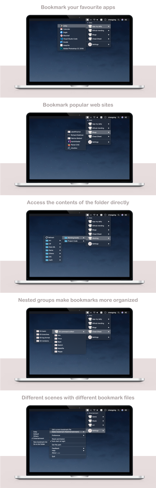

# Hungrymark
##### `bookmark your favorite file , folder and website`

<h5>
  I am an independent developer. I often spend a lot of time searching for information, and I need to collect the webpage and local files, server files, and quickly switch between these materials, I had been used to do it in Evernote, but I found it's still not convenient.    
 
In fact, my demand is to collect resource path, and quickly access them, I wrote a small app to collect these links, the app was originally not intended to be published to AppStore, it's just a self-use tool, but the app is really easy to use, my wife is also using the app, every time she said that the app is so convenient, We should publish it to the AppStore.
 
So I take several days, make icons, unify the UI looking, write help documents, and make a lot of optimization to adjustments the app, Today the app (Hungrymark) is on sale now current price less than $1.
 
Hungrymark makes my life easy that I recommend you try it.

thanks.
</h5>

Any question or sugguesion please submit issue to  
<https://github.com/zhengying/Hungrymark-issue>

or email me: 
<zhengyingok@me.com>

Features:
--

